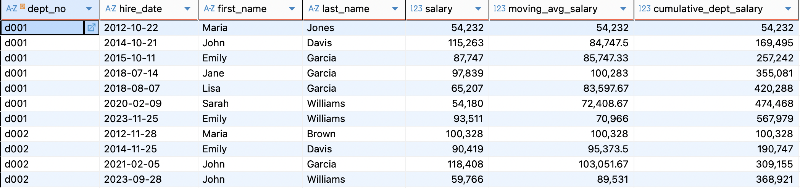

# SQL Practice Project - HR Database
A comprehensive SQL learning project using a custom HR database for advanced SQL query practice.

## Quick Start

### Step 1: Generate HR Database
#### 1. Clone the repository
```
git clone https://github.com/mingjie-wei/SQL_Guidebook.git
cd SQL_Guidebook
```

#### 2. Generate SQLite database
#### 2.1 Create hr database
```
def create_hr_database():
    # Create SQLite database
    conn = sqlite3.connect('company_hr.sqlite')
    cursor = conn.cursor()

    # Create table structure
    tables_sql = [
        """
        CREATE TABLE employees (
            emp_no INTEGER PRIMARY KEY,
            birth_date DATE NOT NULL,
            first_name TEXT NOT NULL,
            last_name TEXT NOT NULL,
            gender TEXT NOT NULL,
            hire_date DATE NOT NULL
        )
        """,
        """
        CREATE TABLE departments (
            dept_no TEXT PRIMARY KEY,
            dept_name TEXT NOT NULL UNIQUE
        )
        """,
        """
        CREATE TABLE dept_emp (
            emp_no INTEGER NOT NULL,
            dept_no TEXT NOT NULL,
            from_date DATE NOT NULL,
            to_date DATE NOT NULL,
            PRIMARY KEY (emp_no, dept_no),
            FOREIGN KEY (emp_no) REFERENCES employees(emp_no),
            FOREIGN KEY (dept_no) REFERENCES departments(dept_no)
        )
        """,
        """
        CREATE TABLE dept_manager (
            dept_no TEXT NOT NULL,
            emp_no INTEGER NOT NULL,
            from_date DATE NOT NULL,
            to_date DATE NOT NULL,
            PRIMARY KEY (dept_no, emp_no),
            FOREIGN KEY (emp_no) REFERENCES employees(emp_no),
            FOREIGN KEY (dept_no) REFERENCES departments(dept_no)
        )
        """,
        """
        CREATE TABLE salaries (
            emp_no INTEGER NOT NULL,
            salary INTEGER NOT NULL,
            from_date DATE NOT NULL,
            to_date DATE NOT NULL,
            PRIMARY KEY (emp_no, from_date),
            FOREIGN KEY (emp_no) REFERENCES employees(emp_no)
        )
        """,
        """
        CREATE TABLE titles (
            emp_no INTEGER NOT NULL,
            title TEXT NOT NULL,
            from_date DATE NOT NULL,
            to_date DATE NOT NULL,
            PRIMARY KEY (emp_no, title, from_date),
            FOREIGN KEY (emp_no) REFERENCES employees(emp_no)
        )
        """
    ]

    # Execute table creation statements
    for sql in tables_sql:
        cursor.execute(sql)

    # Insert sample data
    insert_sample_data(cursor)

    conn.commit()
    conn.close()
    print("✅ HR database created successfully: company_hr.sqlite")
```

#### 2.2 Insert sample data
```
def insert_sample_data(cursor):

    # Insert department data
    departments = [
        ('d001', 'Marketing'),
        ('d002', 'Finance'),
        ('d003', 'Human Resources'),
        ('d004', 'Production'),
        ('d005', 'Development'),
        ('d006', 'Quality Management'),
        ('d007', 'Sales'),
        ('d008', 'Research'),
        ('d009', 'Customer Service')
    ]
    cursor.executemany("INSERT INTO departments VALUES (?, ?)", departments)

    # Insert employee data (50 employees)
    employees = []
    first_names = ['John', 'Jane', 'Robert', 'Emily',
                   'Michael', 'Sarah', 'David', 'Lisa', 'James', 'Maria']
    last_names = ['Smith', 'Johnson', 'Williams', 'Brown', 'Jones',
                  'Garcia', 'Miller', 'Davis', 'Rodriguez', 'Martinez']

    for i in range(1, 51):
        emp_no = 10000 + i
        birth_date = f"{random.randint(1960, 1990)}-{random.randint(1, 12):02d}-{random.randint(1, 28):02d}"
        first_name = random.choice(first_names)
        last_name = random.choice(last_names)
        gender = random.choice(['M', 'F'])
        hire_date = f"{random.randint(2010, 2023)}-{random.randint(1, 12):02d}-{random.randint(1, 28):02d}"
        employees.append((emp_no, birth_date, first_name,
                         last_name, gender, hire_date))

    cursor.executemany(
        "INSERT INTO employees VALUES (?, ?, ?, ?, ?, ?)", employees)

    # Insert department assignments
    dept_assignments = []
    for emp_no in range(10001, 10051):
        dept_no = random.choice(
            ['d001', 'd002', 'd003', 'd004', 'd005', 'd006', 'd007', 'd008', 'd009'])
        from_date = f"{random.randint(2015, 2023)}-{random.randint(1, 12):02d}-{random.randint(1, 28):02d}"
        to_date = '9999-01-01'  # Current employment
        dept_assignments.append((emp_no, dept_no, from_date, to_date))

    cursor.executemany(
        "INSERT INTO dept_emp VALUES (?, ?, ?, ?)", dept_assignments)

    # Insert department managers
    managers = [
        ('d001', 10001, '2018-01-01', '9999-01-01'),
        ('d002', 10005, '2019-03-15', '9999-01-01'),
        ('d003', 10012, '2020-06-01', '9999-01-01'),
        ('d004', 10018, '2017-11-01', '9999-01-01'),
        ('d005', 10025, '2021-02-01', '9999-01-01')
    ]
    cursor.executemany(
        "INSERT INTO dept_manager VALUES (?, ?, ?, ?)", managers)

    # Insert salary data
    salaries = []
    for emp_no in range(10001, 10051):
        base_salary = random.randint(50000, 120000)
        from_date = f"{random.randint(2015, 2023)}-{random.randint(1, 12):02d}-{random.randint(1, 28):02d}"
        to_date = '9999-01-01'
        salaries.append((emp_no, base_salary, from_date, to_date))

    cursor.executemany("INSERT INTO salaries VALUES (?, ?, ?, ?)", salaries)

    # Insert job titles data
    titles_data = []
    job_titles = ['Engineer', 'Senior Engineer', 'Manager',
                  'Analyst', 'Senior Analyst', 'Director', 'Assistant']

    for emp_no in range(10001, 10051):
        title = random.choice(job_titles)
        from_date = f"{random.randint(2015, 2023)}-{random.randint(1, 12):02d}-{random.randint(1, 28):02d}"
        to_date = '9999-01-01'
        titles_data.append((emp_no, title, from_date, to_date))

    cursor.executemany("INSERT INTO titles VALUES (?, ?, ?, ?)", titles_data)

```

#### 2.3 Expected output:
```
✅ HR database created successfully: company_hr.sqlite
```

### Step 2: Connect with DBeaver
1. Open DBeaver

2. Create new connection and select SQLite

3. Database file: browse and select `company_hr.sqlite`

4. Click "Finish"

### Step 3: Verify Connection
Run a test query to verify the database:
```
select * from departments limit 10;
```

## Database Schema
The HR database contains 6 tables with realistic relationships:

- `employees` - Employee master data

- `departments` - Department information

- `dept_emp` - Employee department assignments

- `dept_manager` - Department managers

- `salaries` - Salary records

- `titles` - Job title history

## SQL Practice Exercises
### 1. SELECT, WHERE, ORDER BY - Basic employee queries
```
-- 1.1 Select all employees
select * from employees;
```


```
-- 1.2 Find female employees
select * from employees where gender = 'F';
```


```
-- 1.3 Employees hired after 2020
select * from employees where hire_date >= '2020-01-01' order by hire_date;
/* There is no year() function in SQLite*/
```


```
-- 1.4 Employees with specific last names
select * from employees where last_name in ('Williams', 'Jones');
```


```
-- 1.5 Count employees by gender
select gender, count(*) as cnt
from employees 
group by 1;
```


```
-- 1.6 Limit results with pagination
select emp_no, first_name, last_name, hire_date
from employees
order by hire_date desc
limit 10;
```


### 2. JOIN Operations - Combine employee and department data
```
--make one row invalid
update dept_emp 
set to_date = '2025-10-18'
where emp_no = 10001 and to_date = '9999-01-01';
```


```
-- 2.1 Employees with their departments (INNER JOIN)
select t1.emp_no
,t1.first_name
,t1.last_name
,t2.dept_no
,t3.dept_name
from employees t1
inner join dept_emp t2
	on t1.emp_no = t2.emp_no 
inner join departments t3
	on t2.dept_no = t3.dept_no
where t2.to_date = '9999-01-01'
;
```


```
-- 2.2 All departments with employee count (LEFT JOIN)
select t1.dept_name
,count(distinct t2.emp_no) as cnt
from departments t1
left join dept_emp t2
	on t1.dept_no = t2.dept_no and t2.to_date = '9999-01-01'
group by 1
order by 2 desc
;
```


```
-- 2.3 Department managers with employee details (RIGHT JOIN)
select t1.dept_no
,t2.dept_name
,t3.first_name
,t3.last_name
,t1.from_date as manager_since
from departments t2
right join dept_manager t1
	on t1.dept_no = t2.dept_no 
right join employees t3
	on t1.emp_no = t3.emp_no 
where t1.to_date = '9999-01-01'
;
```


```
-- 2.4 Multiple JOIN types example
select t1.emp_no
,t1.first_name
,t1.last_name
,t2.dept_name
,t3.title
,t4.salary
from employees t1
join dept_emp t0 
	on t0.emp_no = t1.emp_no
join departments t2 
	on t0.dept_no = t2.dept_no
join titles t3 
	on t1.emp_no = t3.emp_no
join salaries t4 
	on t1.emp_no = t4.emp_no
where t0.to_date = '9999-01-01'
    and t3.to_date = '9999-01-01'
    and t4.to_date = '9999-01-01'
;
```


### 3. Aggregate Functions - Count, average, max/min analysis
```
-- Department salary statistics
select t1.dept_name
,count(distinct t2.emp_no) as emp_cnt
,round(avg(t3.salary),2) as avg_salary
,min(t3.salary) as min_salary
,max(t3.salary) as max_salary
,sum(t3.salary) as total_salary
from departments t1
left join dept_emp t2
	on t1.dept_no = t2.dept_no 
left join salaries t3
	on t2.emp_no = t3.emp_no
where t2.to_date = '9999-01-01'
	and t3.to_date = '9999-01-01'
group by t1.dept_name
order by avg_salary desc
;
```


### 4. GROUP BY & HAVING - Department-level summaries
```
-- HAVING clause - departments with high average salary
select t1.dept_name
,count(distinct t2.emp_no) as emp_cnt
,round(avg(t3.salary),2) as avg_salary
from departments t1
left join dept_emp t2
	on t1.dept_no = t2.dept_no 
left join salaries t3
	on t2.emp_no = t3.emp_no
where t2.to_date = '9999-01-01'
	and t3.to_date = '9999-01-01'
group by t1.dept_name
having avg(t3.salary) > 80000
order by avg_salary desc
;
```


### 5. CASE WHEN - Data transformation and categorization
```
-- CASE WHEN for salary categorization
select t1.emp_no
,t1.first_name
,t1.last_name
,t2.dept_name
,t3.salary
,case when t3.salary < 60000 then 'Entry Level'
      when t3.salary between 60000 and 90000 then 'Mid Level'
      when t3.salary between 90001 and 120000 then 'Senior Level'
      else 'Executive'
    end as salary_grade
,case when t1.gender = 'M' then 'Male'
      when t1.gender = 'F' then 'Female'
      else 'Other'
    end as gender_full
from employees t1
left join dept_emp t0 
	on t1.emp_no = t0.emp_no
left join departments t2 
	on t0.dept_no = t2.dept_no
left join salaries t3 
	on t1.emp_no = t3.emp_no
where t0.to_date = '9999-01-01'
    and t3.to_date = '9999-01-01'
order by t3.salary desc
;
```


### 6. Window Functions - Rankings and partitions
```
-- 6.1 Salary ranking within departments
select t1.emp_no
,t1.first_name
,t1.last_name
,t2.dept_name
,t3.salary
,rank() over(partition by t2.dept_name order by t3.salary desc) as salary_rank
,round(percent_rank() over(partition by t2.dept_name order by t3.salary),3) as percentile_rank
from employees t1
left join dept_emp t0 
	on t1.emp_no = t0.emp_no 
left join departments t2
	on t0.dept_no = t2.dept_no 
left join salaries t3
	on t1.emp_no = t3.emp_no
where t0.to_date = '9999-01-01'
    and t3.to_date = '9999-01-01'
order by t2.dept_name, salary_rank
;
```


```
-- 6.2 Moving average and cumulative salary
select t3.dept_no
,t1.hire_date
,t1.first_name
,t1.last_name
,t2.salary
,round(avg(t2.salary) over(
	partition by t3.dept_no order by t1.hire_date
	rows between 2 preceding and current row),2) as moving_avg_salary
,sum(t2.salary) over(
	partition by t3.dept_no order by t1.hire_date) as cumulative_dept_salary
from employees t1
left join salaries t2
	on t1.emp_no = t2.emp_no 
left join dept_emp t3
	on t1.emp_no = t3.emp_no 
where t2.to_date = '9999-01-01'
    and t3.to_date = '9999-01-01'
order by t3.dept_no, t1.hire_date
;
```


### 7. Common Table Expressions (CTE) & COALESCE for handling missing data
```
-- Multiple CTEs for high_earners analysis
with high_earners as (
	select t1.emp_no
	,t1.first_name
	,t1.last_name
	,t3.salary
	,t2.dept_name
	from employees t1
	left join dept_emp t0
		on t1.emp_no = t0.emp_no 
	left join departments t2
		on t0.dept_no = t2.dept_no 
	left join salaries t3
		on t1.emp_no = t3.emp_no 
	where t3.salary > 100000
		and t3.to_date = '9999-01-01'
		and t0.to_date = '9999-01-01'
),
dept_high_earners as (
	select dept_name
	,count(*) as high_earner_count
	from high_earners 
	group by 1
)

select 
    d.dept_name,
    count(de.emp_no) as total_employees,
    coalesce(dhec.high_earner_count, 0) as high_earners,
    round(coalesce(dhec.high_earner_count, 0) * 100.0 / count(de.emp_no), 2) as high_earner_percentage
from departments d
left join dept_emp de 
	on d.dept_no = de.dept_no and de.to_date = '9999-01-01'
left join dept_high_earners dhec 
	on d.dept_name = dhec.dept_name
group by d.dept_name, dhec.high_earner_count
order by high_earner_percentage desc
;
```


### 8. Date Functions - Tenure and timeline analysis

### 9. LAG/LEAD - Temporal data comparison
```
-- LAG and LEAD for salary comparison
select t1.emp_no
,t1.hire_date 
,t4.title
,t3.salary as current_salary
,lag(t3.salary) over (partition by t4.title order by t1.hire_date) as previous_salary
,lead(t3.salary) over (partition by t4.title order by t1.hire_date) as next_salary
from employees t1
left join dept_emp t0
	on t1.emp_no = t0.emp_no
left join departments t2
	on t0.dept_no = t2.dept_no
left join salaries t3
	on t1.emp_no = t3.emp_no
left join titles t4
	on t1.emp_no = t4.emp_no
where t0.to_date = '9999-01-01'
	and t4.to_date = '9999-01-01'
order by t4.title, t1.hire_date
;
```


### 10. UNION/EXCEPT - Set operations