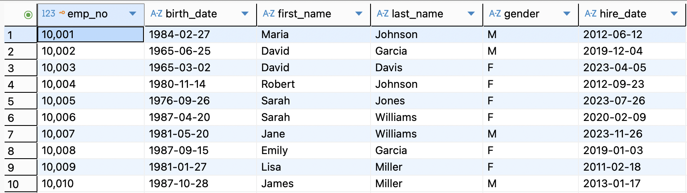

# SQL Practice Project - HR Database
A comprehensive SQL learning project using a custom HR database for advanced SQL query practice.

## Quick Start

### Step 1: Generate HR Database
#### 1. Clone the repository
```
git clone https://github.com/mingjie-wei/SQL_Guidebook.git
cd SQL_Guidebook
```

#### 2. Generate SQLite database
#### 2.1 Create hr database
```
def create_hr_database():
    # Create SQLite database
    conn = sqlite3.connect('company_hr.sqlite')
    cursor = conn.cursor()

    # Create table structure
    tables_sql = [
        """
        CREATE TABLE employees (
            emp_no INTEGER PRIMARY KEY,
            birth_date DATE NOT NULL,
            first_name TEXT NOT NULL,
            last_name TEXT NOT NULL,
            gender TEXT NOT NULL,
            hire_date DATE NOT NULL
        )
        """,
        """
        CREATE TABLE departments (
            dept_no TEXT PRIMARY KEY,
            dept_name TEXT NOT NULL UNIQUE
        )
        """,
        """
        CREATE TABLE dept_emp (
            emp_no INTEGER NOT NULL,
            dept_no TEXT NOT NULL,
            from_date DATE NOT NULL,
            to_date DATE NOT NULL,
            PRIMARY KEY (emp_no, dept_no),
            FOREIGN KEY (emp_no) REFERENCES employees(emp_no),
            FOREIGN KEY (dept_no) REFERENCES departments(dept_no)
        )
        """,
        """
        CREATE TABLE dept_manager (
            dept_no TEXT NOT NULL,
            emp_no INTEGER NOT NULL,
            from_date DATE NOT NULL,
            to_date DATE NOT NULL,
            PRIMARY KEY (dept_no, emp_no),
            FOREIGN KEY (emp_no) REFERENCES employees(emp_no),
            FOREIGN KEY (dept_no) REFERENCES departments(dept_no)
        )
        """,
        """
        CREATE TABLE salaries (
            emp_no INTEGER NOT NULL,
            salary INTEGER NOT NULL,
            from_date DATE NOT NULL,
            to_date DATE NOT NULL,
            PRIMARY KEY (emp_no, from_date),
            FOREIGN KEY (emp_no) REFERENCES employees(emp_no)
        )
        """,
        """
        CREATE TABLE titles (
            emp_no INTEGER NOT NULL,
            title TEXT NOT NULL,
            from_date DATE NOT NULL,
            to_date DATE NOT NULL,
            PRIMARY KEY (emp_no, title, from_date),
            FOREIGN KEY (emp_no) REFERENCES employees(emp_no)
        )
        """
    ]

    # Execute table creation statements
    for sql in tables_sql:
        cursor.execute(sql)

    # Insert sample data
    insert_sample_data(cursor)

    conn.commit()
    conn.close()
    print("✅ HR database created successfully: company_hr.sqlite")
```

#### 2.2 Insert sample data
```
def insert_sample_data(cursor):

    # Insert department data
    departments = [
        ('d001', 'Marketing'),
        ('d002', 'Finance'),
        ('d003', 'Human Resources'),
        ('d004', 'Production'),
        ('d005', 'Development'),
        ('d006', 'Quality Management'),
        ('d007', 'Sales'),
        ('d008', 'Research'),
        ('d009', 'Customer Service')
    ]
    cursor.executemany("INSERT INTO departments VALUES (?, ?)", departments)

    # Insert employee data (50 employees)
    employees = []
    first_names = ['John', 'Jane', 'Robert', 'Emily',
                   'Michael', 'Sarah', 'David', 'Lisa', 'James', 'Maria']
    last_names = ['Smith', 'Johnson', 'Williams', 'Brown', 'Jones',
                  'Garcia', 'Miller', 'Davis', 'Rodriguez', 'Martinez']

    for i in range(1, 51):
        emp_no = 10000 + i
        birth_date = f"{random.randint(1960, 1990)}-{random.randint(1, 12):02d}-{random.randint(1, 28):02d}"
        first_name = random.choice(first_names)
        last_name = random.choice(last_names)
        gender = random.choice(['M', 'F'])
        hire_date = f"{random.randint(2010, 2023)}-{random.randint(1, 12):02d}-{random.randint(1, 28):02d}"
        employees.append((emp_no, birth_date, first_name,
                         last_name, gender, hire_date))

    cursor.executemany(
        "INSERT INTO employees VALUES (?, ?, ?, ?, ?, ?)", employees)

    # Insert department assignments
    dept_assignments = []
    for emp_no in range(10001, 10051):
        dept_no = random.choice(
            ['d001', 'd002', 'd003', 'd004', 'd005', 'd006', 'd007', 'd008', 'd009'])
        from_date = f"{random.randint(2015, 2023)}-{random.randint(1, 12):02d}-{random.randint(1, 28):02d}"
        to_date = '9999-01-01'  # Current employment
        dept_assignments.append((emp_no, dept_no, from_date, to_date))

    cursor.executemany(
        "INSERT INTO dept_emp VALUES (?, ?, ?, ?)", dept_assignments)

    # Insert department managers
    managers = [
        ('d001', 10001, '2018-01-01', '9999-01-01'),
        ('d002', 10005, '2019-03-15', '9999-01-01'),
        ('d003', 10012, '2020-06-01', '9999-01-01'),
        ('d004', 10018, '2017-11-01', '9999-01-01'),
        ('d005', 10025, '2021-02-01', '9999-01-01')
    ]
    cursor.executemany(
        "INSERT INTO dept_manager VALUES (?, ?, ?, ?)", managers)

    # Insert salary data
    salaries = []
    for emp_no in range(10001, 10051):
        base_salary = random.randint(50000, 120000)
        from_date = f"{random.randint(2015, 2023)}-{random.randint(1, 12):02d}-{random.randint(1, 28):02d}"
        to_date = '9999-01-01'
        salaries.append((emp_no, base_salary, from_date, to_date))

    cursor.executemany("INSERT INTO salaries VALUES (?, ?, ?, ?)", salaries)

    # Insert job titles data
    titles_data = []
    job_titles = ['Engineer', 'Senior Engineer', 'Manager',
                  'Analyst', 'Senior Analyst', 'Director', 'Assistant']

    for emp_no in range(10001, 10051):
        title = random.choice(job_titles)
        from_date = f"{random.randint(2015, 2023)}-{random.randint(1, 12):02d}-{random.randint(1, 28):02d}"
        to_date = '9999-01-01'
        titles_data.append((emp_no, title, from_date, to_date))

    cursor.executemany("INSERT INTO titles VALUES (?, ?, ?, ?)", titles_data)

```

#### 2.3 Expected output:
```
✅ HR database created successfully: company_hr.sqlite
```

### Step 2: Connect with DBeaver
1. Open DBeaver

2. Create new connection and select SQLite

3. Database file: browse and select `company_hr.sqlite`

4. Click "Finish"

### Step 3: Verify Connection
Run a test query to verify the database:
```
select * from departments limit 10;
```

## Database Schema
The HR database contains 6 tables with realistic relationships:

- `employees` - Employee master data

- `departments` - Department information

- `dept_emp` - Employee department assignments

- `dept_manager` - Department managers

- `salaries` - Salary records

- `titles` - Job title history

## SQL Practice Exercises
### 1. SELECT, WHERE, ORDER BY - Basic employee queries
```
-- 1.1 Select all employees
select * from employees;
```


```
-- 1.2 Find female employees
select * from employees where gender = 'F';
```


```
-- 1.3 Employees hired after 2020
select * from employees where hire_date >= '2020-01-01' order by hire_date;
/* There is no year() function in SQLite*/
```


```
-- 1.4 Employees with specific last names
select * from employees where last_name in ('Williams', 'Jones');
```


```
-- 1.5 Count employees by gender
select gender, count(*) as cnt
from employees 
group by 1;
```


```
-- 1.6 Limit results with pagination
select emp_no, first_name, last_name, hire_date
from employees
order by hire_date desc
limit 10;
```


### 2. JOIN Operations - Combine employee and department data
```
--make one row invalid
update dept_emp 
set to_date = '2025-10-18'
where emp_no = 10001 and to_date = '9999-01-01';
```


```
-- 2.1 Employees with their departments (INNER JOIN)
select t1.emp_no
,t1.first_name
,t1.last_name
,t2.dept_no
,t3.dept_name
from employees t1
inner join dept_emp t2
	on t1.emp_no = t2.emp_no 
inner join departments t3
	on t2.dept_no = t3.dept_no
where t2.to_date = '9999-01-01'
;
```


```
-- 2.2 All departments with employee count (LEFT JOIN)
select t1.dept_name
,count(distinct t2.emp_no) as cnt
from departments t1
left join dept_emp t2
	on t1.dept_no = t2.dept_no and t2.to_date = '9999-01-01'
group by 1
order by 2 desc
;
```


```
-- 2.3 Department managers with employee details (RIGHT JOIN)
select t1.dept_no
,t2.dept_name
,t3.first_name
,t3.last_name
,t1.from_date as manager_since
from departments t2
right join dept_manager t1
	on t1.dept_no = t2.dept_no 
right join employees t3
	on t1.emp_no = t3.emp_no 
where t1.to_date = '9999-01-01'
;
```


```
-- 2.4 Multiple JOIN types example
select t1.emp_no
,t1.first_name
,t1.last_name
,t2.dept_name
,t3.title
,t4.salary
from employees t1
join dept_emp t0 
	on t0.emp_no = t1.emp_no
join departments t2 
	on t0.dept_no = t2.dept_no
join titles t3 
	on t1.emp_no = t3.emp_no
join salaries t4 
	on t1.emp_no = t4.emp_no
where t0.to_date = '9999-01-01'
    and t3.to_date = '9999-01-01'
    and t4.to_date = '9999-01-01'
;
```


### 3. Aggregate Functions - Count, average, max/min analysis
```
-- Department salary statistics
select t1.dept_name
,count(distinct t2.emp_no) as emp_cnt
,round(avg(t3.salary),2) as avg_salary
,min(t3.salary) as min_salary
,max(t3.salary) as max_salary
,sum(t3.salary) as total_salary
from departments t1
left join dept_emp t2
	on t1.dept_no = t2.dept_no 
left join salaries t3
	on t2.emp_no = t3.emp_no
where t2.to_date = '9999-01-01'
	and t3.to_date = '9999-01-01'
group by t1.dept_name
order by avg_salary desc
;
```


### 4. GROUP BY & HAVING - Department-level summaries
```
-- HAVING clause - departments with high average salary
select t1.dept_name
,count(distinct t2.emp_no) as emp_cnt
,round(avg(t3.salary),2) as avg_salary
from departments t1
left join dept_emp t2
	on t1.dept_no = t2.dept_no 
left join salaries t3
	on t2.emp_no = t3.emp_no
where t2.to_date = '9999-01-01'
	and t3.to_date = '9999-01-01'
group by t1.dept_name
having avg(t3.salary) > 80000
order by avg_salary desc
;
```


### 5. CASE WHEN - Data transformation and categorization
```
-- CASE WHEN for salary categorization
select t1.emp_no
,t1.first_name
,t1.last_name
,t2.dept_name
,t3.salary
,case when t3.salary < 60000 then 'Entry Level'
      when t3.salary between 60000 and 90000 then 'Mid Level'
      when t3.salary between 90001 and 120000 then 'Senior Level'
      else 'Executive'
    end as salary_grade
,case when t1.gender = 'M' then 'Male'
      when t1.gender = 'F' then 'Female'
      else 'Other'
    end as gender_full
from employees t1
left join dept_emp t0 
	on t1.emp_no = t0.emp_no
left join departments t2 
	on t0.dept_no = t2.dept_no
left join salaries t3 
	on t1.emp_no = t3.emp_no
where t0.to_date = '9999-01-01'
    and t3.to_date = '9999-01-01'
order by t3.salary desc
;
```


### 6. Window Functions - Rankings and partitions
```
-- 6.1 Salary ranking within departments
select t1.emp_no
,t1.first_name
,t1.last_name
,t2.dept_name
,t3.salary
,rank() over(partition by t2.dept_name order by t3.salary desc) as salary_rank
,round(percent_rank() over(partition by t2.dept_name order by t3.salary),3) as percentile_rank
from employees t1
left join dept_emp t0 
	on t1.emp_no = t0.emp_no 
left join departments t2
	on t0.dept_no = t2.dept_no 
left join salaries t3
	on t1.emp_no = t3.emp_no
where t0.to_date = '9999-01-01'
    and t3.to_date = '9999-01-01'
order by t2.dept_name, salary_rank
;
```


```
-- 6.2 Moving average and cumulative salary
select t3.dept_no
,t1.hire_date
,t1.first_name
,t1.last_name
,t2.salary
,round(avg(t2.salary) over(
	partition by t3.dept_no order by t1.hire_date
	rows between 2 preceding and current row),2) as moving_avg_salary
,sum(t2.salary) over(
	partition by t3.dept_no order by t1.hire_date) as cumulative_dept_salary
from employees t1
left join salaries t2
	on t1.emp_no = t2.emp_no 
left join dept_emp t3
	on t1.emp_no = t3.emp_no 
where t2.to_date = '9999-01-01'
    and t3.to_date = '9999-01-01'
order by t3.dept_no, t1.hire_date
;
```


### 7. Common Table Expressions (CTE) & COALESCE for handling missing data
```
-- Multiple CTEs for high_earners analysis
with high_earners as (
	select t1.emp_no
	,t1.first_name
	,t1.last_name
	,t3.salary
	,t2.dept_name
	from employees t1
	left join dept_emp t0
		on t1.emp_no = t0.emp_no 
	left join departments t2
		on t0.dept_no = t2.dept_no 
	left join salaries t3
		on t1.emp_no = t3.emp_no 
	where t3.salary > 100000
		and t3.to_date = '9999-01-01'
		and t0.to_date = '9999-01-01'
),
dept_high_earners as (
	select dept_name
	,count(*) as high_earner_count
	from high_earners 
	group by 1
)

select 
    d.dept_name,
    count(de.emp_no) as total_employees,
    coalesce(dhec.high_earner_count, 0) as high_earners,
    round(coalesce(dhec.high_earner_count, 0) * 100.0 / count(de.emp_no), 2) as high_earner_percentage
from departments d
left join dept_emp de 
	on d.dept_no = de.dept_no and de.to_date = '9999-01-01'
left join dept_high_earners dhec 
	on d.dept_name = dhec.dept_name
group by d.dept_name, dhec.high_earner_count
order by high_earner_percentage desc
;
```


### 8. Date Functions - Tenure analysis
```
-- Employee tenure calculation
select emp_no
,first_name
,hire_date
,date() as current_date
,julianday(date()) - julianday(hire_date) as days_employed
,round((julianday(date()) - julianday(hire_date)) / 365.25, 2) as years_employed
,case when (julianday(date()) - julianday(hire_date)) / 365.25 >= 5 then 'senior'
      when (julianday(date()) - julianday(hire_date)) / 365.25 >= 2 then 'mid-level'
      else 'junior'
    end as experience_level
from employees
where hire_date is not null
order by years_employed desc
;
```


### 9. LAG/LEAD - Temporal data comparison
```
-- LAG and LEAD for salary comparison
select t1.emp_no
,t1.hire_date 
,t4.title
,t3.salary as current_salary
,lag(t3.salary) over (partition by t4.title order by t1.hire_date) as previous_salary
,lead(t3.salary) over (partition by t4.title order by t1.hire_date) as next_salary
from employees t1
left join dept_emp t0
	on t1.emp_no = t0.emp_no
left join departments t2
	on t0.dept_no = t2.dept_no
left join salaries t3
	on t1.emp_no = t3.emp_no
left join titles t4
	on t1.emp_no = t4.emp_no
where t0.to_date = '9999-01-01'
	and t4.to_date = '9999-01-01'
order by t4.title, t1.hire_date
;
```


### 10. Interview practice questions
```
-- 10.1 find the second highest salary in each department
with rankedsalaries as (
    select e.emp_no,
        e.first_name,
        e.last_name,
        d.dept_name,
        s.salary,
        dense_rank() over (partition by d.dept_name order by s.salary desc) as salary_rank
    from employees e
    left join dept_emp de 
    	on e.emp_no = de.emp_no
    left join departments d 
    	on de.dept_no = d.dept_no
    left join salaries s 
    	on e.emp_no = s.emp_no
    where de.to_date = '9999-01-01'
        and s.to_date = '9999-01-01'
)
select emp_no,
    first_name,
    last_name,
    dept_name,
    salary
from rankedsalaries
where salary_rank = 2
;
```


```
-- 10.2 employees who are managers (self-join concept)
select 
    e.emp_no,
    e.first_name,
    e.last_name,
    d.dept_name,
    'manager' as role_type
from employees e
join dept_manager dm on e.emp_no = dm.emp_no
join departments d on dm.dept_no = d.dept_no
where dm.to_date = '9999-01-01'

union

select 
    e.emp_no,
    e.first_name,
    e.last_name,
    d.dept_name,
    'regular employee' as role_type
from employees e
join dept_emp de on e.emp_no = de.emp_no
join departments d on de.dept_no = d.dept_no
left join dept_manager dm on e.emp_no = dm.emp_no and dm.to_date = '9999-01-01'
where de.to_date = '9999-01-01'
    and dm.emp_no is null
;
```


```
-- 10.3 find departments where average salary is above company average
with companystats as (
    select 
        avg(s.salary) as company_avg_salary
    from salaries s
    where s.to_date = '9999-01-01'
)
select 
    d.dept_name,
    count(distinct e.emp_no) as employee_count,
    round(avg(s.salary), 2) as dept_avg_salary,
    cs.company_avg_salary,
    round(avg(s.salary) - cs.company_avg_salary, 2) as difference_from_avg
from departments d
join dept_emp de on d.dept_no = de.dept_no
join employees e on de.emp_no = e.emp_no
join salaries s on e.emp_no = s.emp_no
cross join companystats cs
where de.to_date = '9999-01-01'
    and s.to_date = '9999-01-01'
group by d.dept_name, cs.company_avg_salary
having avg(s.salary) > cs.company_avg_salary
order by difference_from_avg desc
;
```


# PostgreSQL SQL Cheat Sheet

## SQL Query Execution Order
### Logical Execution Sequence:
```
1. FROM / JOIN      -- Identify data sources
2. WHERE           -- Row-level filtering
3. GROUP BY        -- Group rows
4. HAVING          -- Group-level filtering
5. SELECT          -- Select columns
6. DISTINCT        -- Remove duplicates
7. ORDER BY        -- Sort results
8. LIMIT/OFFSET    -- Pagination
```
### Practical Example:
```
SELECT 
    department_id,
    COUNT(*) as emp_count,
    AVG(salary) as avg_salary
FROM employees
JOIN departments USING(department_id)
WHERE hire_date > '2020-01-01'
GROUP BY department_id
HAVING AVG(salary) > 50000
ORDER BY avg_salary DESC
LIMIT 10;
```

## Basic Queries
### SELECT Statements
```
-- Basic queries
SELECT * FROM table_name;
SELECT column1, column2 FROM table_name;
SELECT DISTINCT column1 FROM table_name;

-- Conditional queries
SELECT * FROM employees WHERE salary > 50000;
SELECT * FROM employees WHERE name LIKE 'J%';
SELECT * FROM employees WHERE department_id IN (1, 2, 3);
SELECT * FROM employees WHERE salary BETWEEN 30000 AND 60000;

-- Sorting and limiting
SELECT * FROM employees ORDER BY hire_date DESC;
SELECT * FROM employees ORDER BY salary DESC, name ASC;
SELECT * FROM employees LIMIT 10 OFFSET 20;  -- Pagination
```

### Aggregate Functions
```
SELECT 
    COUNT(*) as total_employees,
    COUNT(DISTINCT department_id) as unique_departments,
    AVG(salary) as average_salary,
    MAX(salary) as max_salary,
    MIN(salary) as min_salary,
    SUM(salary) as total_salary_budget
FROM employees;
```

## JOIN Operations
### JOIN Types
```
-- INNER JOIN (default)
SELECT e.name, d.department_name
FROM employees e
INNER JOIN departments d ON e.department_id = d.id;

-- LEFT JOIN
SELECT e.name, d.department_name
FROM employees e
LEFT JOIN departments d ON e.department_id = d.id;

-- RIGHT JOIN
SELECT e.name, d.department_name
FROM employees e
RIGHT JOIN departments d ON e.department_id = d.id;

-- FULL OUTER JOIN
SELECT e.name, d.department_name
FROM employees e
FULL OUTER JOIN departments d ON e.department_id = d.id;

-- CROSS JOIN
SELECT e.name, d.department_name
FROM employees e
CROSS JOIN departments d;

-- SELF JOIN
SELECT e1.name as employee, e2.name as manager
FROM employees e1
LEFT JOIN employees e2 ON e1.manager_id = e2.employee_id;
```

### Multiple Table Joins
```
SELECT 
    e.first_name,
    e.last_name,
    d.department_name,
    t.title,
    s.salary
FROM employees e
JOIN dept_emp de ON e.emp_no = de.emp_no
JOIN departments d ON de.dept_no = d.dept_no
JOIN titles t ON e.emp_no = t.emp_no
JOIN salaries s ON e.emp_no = s.emp_no
WHERE de.to_date = '9999-01-01'
  AND t.to_date = '9999-01-01'
  AND s.to_date = '9999-01-01';
```

## Window Functions
### Basic Window Functions
```
-- Ranking functions
SELECT 
    employee_id,
    name,
    salary,
    RANK() OVER (ORDER BY salary DESC) as salary_rank,
    DENSE_RANK() OVER (ORDER BY salary DESC) as salary_dense_rank,
    ROW_NUMBER() OVER (ORDER BY salary DESC) as row_num
FROM employees;

-- Partitioned window functions
SELECT 
    department_id,
    employee_id,
    name,
    salary,
    AVG(salary) OVER (PARTITION BY department_id) as dept_avg_salary,
    salary - AVG(salary) OVER (PARTITION BY department_id) as diff_from_avg
FROM employees;
```

### Advanced Window Functions
```
-- LAG/LEAD for time series analysis
SELECT 
    employee_id,
    salary_date,
    salary,
    LAG(salary) OVER (PARTITION BY employee_id ORDER BY salary_date) as prev_salary,
    LEAD(salary) OVER (PARTITION BY employee_id ORDER BY salary_date) as next_salary,
    salary - LAG(salary) OVER (PARTITION BY employee_id ORDER BY salary_date) as salary_change
FROM salaries;

-- Moving averages and cumulative sums
SELECT 
    employee_id,
    salary_date,
    salary,
    AVG(salary) OVER (
        PARTITION BY employee_id 
        ORDER BY salary_date 
        ROWS BETWEEN 2 PRECEDING AND CURRENT ROW
    ) as moving_avg,
    SUM(salary) OVER (
        PARTITION BY employee_id 
        ORDER BY salary_date
        ROWS BETWEEN UNBOUNDED PRECEDING AND CURRENT ROW
    ) as cumulative_salary
FROM salaries;
```

## Common Table Expressions (CTEs) & Subqueries
### Common Table Expressions
```
-- Simple CTE
WITH DepartmentStats AS (
    SELECT 
        department_id,
        COUNT(*) as employee_count,
        AVG(salary) as avg_salary
    FROM employees
    GROUP BY department_id
)
SELECT * FROM DepartmentStats WHERE avg_salary > 50000;

-- Multiple CTEs
WITH 
HighEarners AS (
    SELECT employee_id, salary
    FROM employees
    WHERE salary > 100000
),
DepartmentHighEarners AS (
    SELECT 
        d.department_name,
        COUNT(he.employee_id) as high_earner_count
    FROM departments d
    LEFT JOIN employees e ON d.department_id = e.department_id
    LEFT JOIN HighEarners he ON e.employee_id = he.employee_id
    GROUP BY d.department_name
)
SELECT * FROM DepartmentHighEarners ORDER BY high_earner_count DESC;
```

### Recursive CTEs
```
-- Organizational hierarchy query
WITH RECURSIVE EmployeeHierarchy AS (
    -- Base case: top-level managers
    SELECT 
        employee_id,
        name,
        manager_id,
        1 as level,
        ARRAY[employee_id] as path
    FROM employees
    WHERE manager_id IS NULL
    
    UNION ALL
    
    -- Recursive case: subordinates
    SELECT 
        e.employee_id,
        e.name,
        e.manager_id,
        eh.level + 1,
        eh.path || e.employee_id
    FROM employees e
    JOIN EmployeeHierarchy eh ON e.manager_id = eh.employee_id
)
SELECT * FROM EmployeeHierarchy ORDER BY path;
```

## Data Modification
### INSERT Operations
```
-- Insert single row
INSERT INTO employees (first_name, last_name, hire_date, salary)
VALUES ('John', 'Doe', '2024-01-15', 60000);

-- Insert multiple rows
INSERT INTO employees (first_name, last_name, hire_date, salary)
VALUES 
    ('Jane', 'Smith', '2024-01-16', 65000),
    ('Bob', 'Johnson', '2024-01-17', 70000);

-- Insert from query results
INSERT INTO employee_archive
SELECT * FROM employees WHERE hire_date < '2020-01-01';
```

### UPDATE Operations
```
-- Basic update
UPDATE employees 
SET salary = salary * 1.05 
WHERE department_id = 1;

-- Update with subquery
UPDATE employees 
SET salary = (
    SELECT AVG(salary) 
    FROM employees 
    WHERE department_id = employees.department_id
) 
WHERE salary < 50000;

-- Update with JOIN
UPDATE employees 
SET salary = salary * 1.10
FROM departments 
WHERE employees.department_id = departments.department_id
AND departments.department_name = 'Engineering';
```

### DELETE Operations
```
-- Delete specific rows
DELETE FROM employees 
WHERE hire_date < '2010-01-01';

-- Delete with subquery
DELETE FROM employees 
WHERE department_id IN (
    SELECT department_id 
    FROM departments 
    WHERE location = 'Remote'
);
```

## Conditional Logic
### CASE Expressions
```
-- Simple CASE
SELECT 
    name,
    salary,
    CASE 
        WHEN salary < 50000 THEN 'Entry Level'
        WHEN salary BETWEEN 50000 AND 80000 THEN 'Mid Level'
        WHEN salary BETWEEN 80001 AND 120000 THEN 'Senior Level'
        ELSE 'Executive'
    END as salary_grade
FROM employees;

-- Searched CASE
SELECT 
    name,
    department_id,
    CASE department_id
        WHEN 1 THEN 'Engineering'
        WHEN 2 THEN 'Sales'
        WHEN 3 THEN 'Marketing'
        ELSE 'Other'
    END as department_name
FROM employees;
```

### COALESCE and NULLIF
```
-- Handle NULL values
SELECT 
    name,
    COALESCE(manager_id, 0) as manager_id,  -- Return 0 if NULL
    COALESCE(bonus, 0) as bonus_amount,
    NULLIF(salary, 0) as salary_no_zero  -- Return NULL if salary=0
FROM employees;
```

## Date & Time Functions
### Date Operations
```
-- Current date and time
SELECT 
    CURRENT_DATE as today,
    CURRENT_TIME as now_time,
    CURRENT_TIMESTAMP as now_timestamp,
    NOW() as current_datetime;

-- Date extraction and calculation
SELECT 
    hire_date,
    EXTRACT(YEAR FROM hire_date) as hire_year,
    EXTRACT(MONTH FROM hire_date) as hire_month,
    AGE(CURRENT_DATE, hire_date) as tenure,
    hire_date + INTERVAL '1 year' as one_year_anniversary,
    hire_date - INTERVAL '1 month' as one_month_ago
FROM employees;

-- Date formatting
SELECT 
    hire_date,
    TO_CHAR(hire_date, 'YYYY-MM-DD') as iso_format,
    TO_CHAR(hire_date, 'Month DD, YYYY') as readable_format,
    TO_CHAR(hire_date, 'Day') as day_of_week
FROM employees;
```

## String Functions
### String Operations
```
SELECT 
    first_name,
    last_name,
    -- Concatenation
    first_name || ' ' || last_name as full_name,
    CONCAT(first_name, ' ', last_name) as full_name2,
    
    -- Case conversion
    UPPER(first_name) as upper_first,
    LOWER(last_name) as lower_last,
    INITCAP(first_name) as proper_first,
    
    -- Substring and position
    LENGTH(first_name) as name_length,
    SUBSTRING(first_name FROM 1 FOR 3) as first_three,
    POSITION('a' IN first_name) as a_position,
    
    -- Trimming and padding
    TRIM(first_name) as trimmed_name,
    LPAD(salary::text, 10, '0') as padded_salary,
    
    -- Replacement
    REPLACE(first_name, 'a', '@') as replaced_name
FROM employees;
```

## Set Operations
### UNION, INTERSECT, EXCEPT
```
-- UNION (removes duplicates)
SELECT name FROM current_employees
UNION
SELECT name FROM former_employees;

-- UNION ALL (keeps duplicates)
SELECT name FROM engineering_dept
UNION ALL
SELECT name FROM sales_dept;

-- INTERSECT (common records)
SELECT employee_id FROM full_time_employees
INTERSECT
SELECT employee_id FROM high_performers;

-- EXCEPT (difference)
SELECT employee_id FROM all_employees
EXCEPT
SELECT employee_id FROM managers;
```

## Grouping & Filtering
### GROUP BY and HAVING
```
-- Basic grouping
SELECT 
    department_id,
    COUNT(*) as employee_count,
    AVG(salary) as avg_salary,
    MAX(salary) as max_salary
FROM employees
GROUP BY department_id;

-- Multiple column grouping
SELECT 
    department_id,
    EXTRACT(YEAR FROM hire_date) as hire_year,
    COUNT(*) as hires_count
FROM employees
GROUP BY department_id, EXTRACT(YEAR FROM hire_date);

-- HAVING for group filtering
SELECT 
    department_id,
    AVG(salary) as avg_salary
FROM employees
GROUP BY department_id
HAVING AVG(salary) > 50000
   AND COUNT(*) > 5;
```

## Practical Tips
### Performance Optimization
```
-- Use EXPLAIN to analyze query plan
EXPLAIN ANALYZE SELECT * FROM employees WHERE salary > 50000;

-- Create indexes
CREATE INDEX idx_employees_salary ON employees(salary);
CREATE INDEX idx_employees_dept_date ON employees(department_id, hire_date);

-- Avoid SELECT *
SELECT employee_id, name FROM employees;  -- Better
SELECT * FROM employees;  -- Worse
```

### Quick Reference Tips
1. Execution Order Mnemonic: "From Where Group Having Select Order Limit"

2. JOIN Performance: Filter in WHERE clause rather than after JOIN

3. Index Usage: Create indexes on frequently queried columns

4. CTE Benefits: Improve readability, can be referenced multiple times

5. Window Functions: Use for complex analytics without aggregating data

6. PostgreSQL Extras: Leverage JSON, arrays, and full-text search capabilities